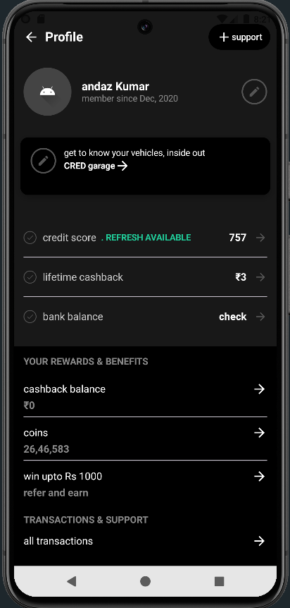

# Profile Screen UI - Jetpack Compose

This project showcases a **modern Profile Activity UI** built using **Jetpack Compose**. It demonstrates the use of Material 3 components, responsive layout design, and composable functions for a clean and modular UI structure.

## 🖼️ Preview

> 📌 *Make sure to add a real screenshot with the filename `screenshot.png` in the root directory of your repository.*

---

## 📱 Features

- Clean and dark-themed Profile UI
- Modular components using `@Composable` functions
- Scrollable layout with `Column` and `rememberScrollState`
- Responsive design with dynamic padding and alignment
- Icons for actions like edit, support, and navigation
- Card view for vehicle information
- Statistics like credit score, cashback, and bank balance
- Rewards and transactions section

---

## 🚀 Live Demo

[🔗 Live Preview on GitHub Pages (or use GitHub APK link)](https://your-live-link-here.com)  
> Replace this with your hosted preview or APK download link.

---

## 📁 Project Structure

- `ProfileScreen.kt`: Main composable UI for the profile screen
- Reusable UI components:
  - `ProfileStatRow2`
  - `ProfileInfoRow`
  - `DividerComponent`
- Preview function to visualize layout in Android Studio

---

## 🛠️ Built With

- Kotlin
- Jetpack Compose
- Android Studio (Electric Eel or later)
- Material 3 Design Components

---

## 📸 Screenshot

---

## 📄 License

This project is open-source and available under the [MIT License](LICENSE).

---

## 🙌 Author

Made with ❤️ by [Your Name](https://github.com/your-username)

